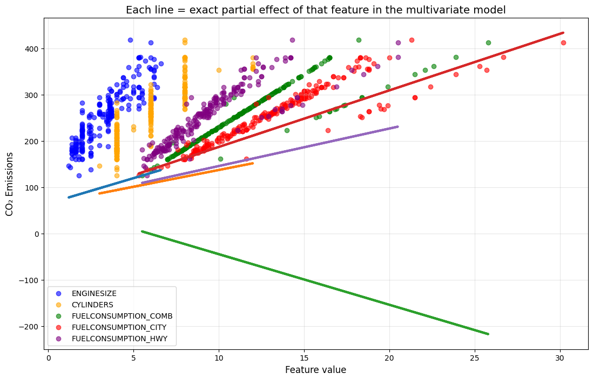

# Why Can a Coefficient Become Negative in Multiple Linear Regression
## When Its Bivariate Relationship Is Clearly Positive?

One of the deepest and most frequently misunderstood concepts in multiple linear regression:

> The regression coefficient is **not** the simple bivariate slope.
> It is the **partial effect** of that variable **while holding all other predictors constant**.

When severe multicollinearity exists, "holding all other predictors constant" becomes a counterfactual — often physically impossible — scenario. In such cases, the sign of the coefficient can completely reverse.

We demonstrate this using the classic Canadian **FuelConsumptionCo2** dataset.


```python
import numpy as np
import pandas as pd
import matplotlib.pyplot as plt
from sklearn.linear_model import LinearRegression
from sklearn.metrics import r2_score
import warnings
warnings.filterwarnings('ignore')

%matplotlib inline
```

### Load the dataset


```python
df = pd.read_csv("/home/pyrz-tech/Desktop/MachineLearning/FuelConsumptionCo2.csv")
df.head()
```
### Select features and target


```python
features = ['ENGINESIZE', 'CYLINDERS', 'FUELCONSUMPTION_COMB',
            'FUELCONSUMPTION_CITY', 'FUELCONSUMPTION_HWY']
target = 'CO2EMISSIONS'

X = df[features]
y = df[target]
```

### Train/test split


```python
np.random.seed(42)
msk = np.random.rand(len(df)) < 0.8
train = df[msk]
test = df[~msk]

print(f"Train size: {len(train)}, Test size: {len(test)}")
```

    Train size: 848, Test size: 219


### Fit multiple linear regression


```python
reg = LinearRegression()
reg.fit(train[features], train[target])

print("Coefficients:", reg.coef_.round(3))
print("Intercept:   ", reg.intercept_.round(3))
```

    Coefficients: [ 10.962   7.25  -10.937  12.227   8.104]
    Intercept:    65.076


### Model performance


```python
pred = reg.predict(test[features])
r2 = r2_score(test[target], pred)
print(f"R² on test set: {r2:.4f}")
```

    R² on test set: 0.8712


### The diagnostic plot that reveals everything


```python
plt.figure(figsize=(13, 8))

colors = ['blue', 'orange', 'green', 'red', 'purple']
labels = features

for i, col in enumerate(features):
    plt.scatter(test[col], test[target], color=colors[i], alpha=0.6, label=labels[i])

# The magic (technically "wrong") line that draws the exact multivariate coefficients
plt.plot(test[features].values,
         reg.coef_ * test[features].values + reg.intercept_,
         linewidth=3)

plt.xlabel('Feature value', fontsize=12)
plt.ylabel('CO₂ Emissions', fontsize=12)
plt.title('Each line = exact partial effect of that feature in the multivariate model', fontsize=14)
plt.legend()
plt.grid(alpha=0.3)
plt.show()
```


    

    


### Why the sign reversal happens

The three fuel consumption variables are nearly perfectly collinear:

```
FUELCONSUMPTION_COMB ≈ 0.55 × CITY + 0.45 × HWY
```

In real data, you almost never observe a change in CITY or HWY while COMB stays fixed.

The regression coefficient for HWY answers the question:
> "What happens to CO₂ if I increase HWY **while holding COMB, CITY, and all other variables constant**?"

That scenario is physically almost impossible → the coefficient becomes negative purely as a mathematical compensation mechanism.

This is known as **sign reversal due to severe multicollinearity** (or the suppressor effect).

### Key takeaways

1. High R² + unexpected coefficient signs → almost always severe multicollinearity
2. In severe multicollinearity, coefficients lose causal interpretability
3. The plot above is one of the clearest diagnostic and teaching tools for this phenomenon
